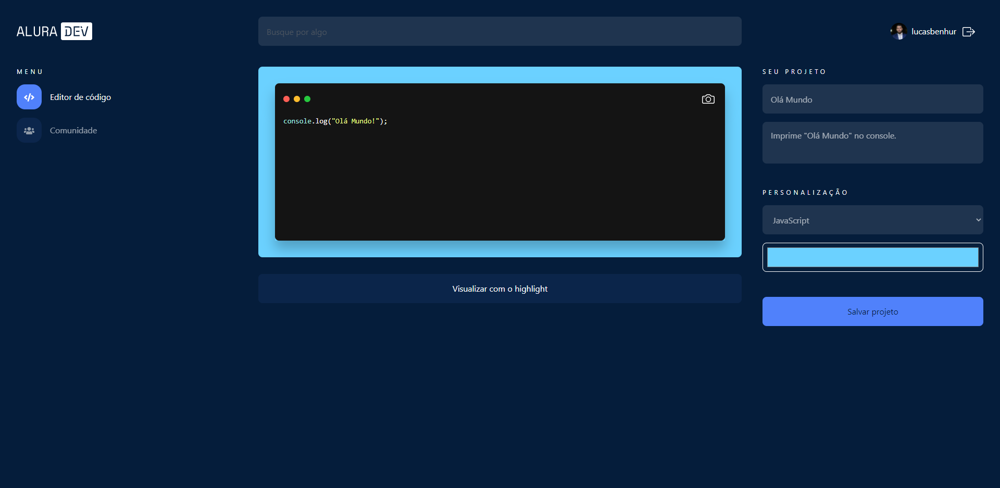
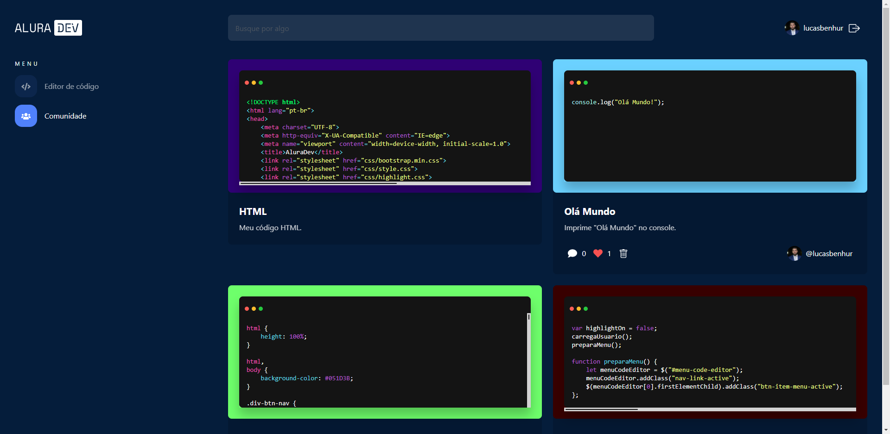

# AluraDev
AluraDev um editor de texto online que te permite salvar seu código na aba comunidade ou exportar um arquivo PNG.

## Como rodar o projeto

Basta clonar o repositório e abrir o index.html no browser (recomendo o Chrome). Pode também usar o VsCode com a extensão "Live Server".

## Como utilizar

 - Para utilizar o editor de código, basta clicar no bloco preto e começar a digitar, após ter digitado o seu código, escolha a linguagem em personalização e clique em "Visualizar com o highlight" para que o highlight se ative.

 - Para alterar a cor de fundo do editor, clique no seletor de cor em personalização e escolha a cor desejada. 
 
 - Para salvar o projeto, é necessario preencher os campos de nome e descrição e fazer o login, após isso clicar em "Salvar projeto". 

 - Para visualizar o seu projeto, basta clicar na aba "Comunidade" no menu da esquerda que lá estará todos os seus projetos criados.

 - Para salvar o seu código em PNG clique no ícone da camera no editor de código.

## Conteúdos

- [Overview](#overview)
  - [Funcionalidades](#funcionalidades)
  - [Screenshots](#screenshots)
  - [Links](#links)
- [Processo](#processo)
  - [Contruido com](#construido-com)
  - [O que eu aprendi](#oque-eu-aprendi)
  - [Continuação do desenvolvimento](#continuacao-do-desenvolvimento)
  - [Recursos úteis](#recursos-uteis)
- [Autor](#autor)

## Overview

### Funcionalidades

Os usuarios serão capazes de:

- Fazer login informando o nome de usuário do GitHub.
- Editar o código e setar o highlight.
- Salvar o seu projeto na aba comunidades.
- Salvar o seu projeto na extensão PNG.
- Verificar seu projeto na aba comunidades.
- Projetos permanecerem na aba comunidades.
- Pesquisar por projetos salvos.

### Screenshots

### Links

- Site hospedado: [AluraDev](https://lucasbenhur.github.io/aluradev)

## Processo

### Construido com

- HTML
- CSS
- JavaScript
- BootStrap
- jQuery
- highlight
- sweetalert2
- html2canvas
- FileSaver

### O que eu aprendi

- Utilizar frameworks como:
  - [Bootstrap](https://getbootstrap.com)
- Utilizar bibliotecas como:
  - [Highlight JS](https://highlightjs.org)
  - [File Saver](https://github.com/eligrey/FileSaver.js)
  - [html2canvas](https://html2canvas.hertzen.com)
  - [sweetalert2](https://sweetalert2.github.io)
  - [jQuery](https://jquery.com)
- Desenvolvimento em grupo, ajudando e sendo ajudado no discord.
- Utilizar o trello para organizar minhas tarefas.
- Utilizar o figma para ver o design e baixar os ícones/imagens.

### Continuação do desenvolvimento

Pretendo adicionar algumas features como:

- Logar com GitHub em vez de buscar pelo nome do usuário para maior segurança.
- Ver e Editar perfil.
- Comentar e mostar comentários.

## Autor

- Linkedin - [Lucas Ben Hur Alcantara](https://www.linkedin.com/in/lucas-ben-hur-alcantara-46042990)
- GitHub - [lucasbenhur](https://github.com/lucasbenhur)
